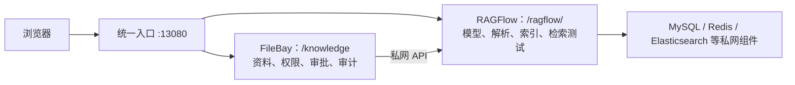

# CheersAI FileBay + RAGFlow 服务器部署与运维手册

> 适用范围：内部试用与受控服务器部署。本文只说明架构关系、启动、停止、升级和常见排障；不包含高可用、灾备或公网开放方案。

## 1. 先理解部署关系

浏览器只有一个访问入口：`http://服务器地址:13080`。



- **FileBay** 是业务工作台：资料入库、审核发布、权限和审计都在这里完成。
- **RAGFlow** 是检索引擎和管理员配置台：配置模型、创建数据集、解析文件、检索测试。
- 两者是**两个独立后端服务**，但由同一个网关统一到一个地址、一个端口下：
  - `http://服务器地址:13080/knowledge`
  - `http://服务器地址:13080/ragflow/`
- 不要把 FileBay 和 RAGFlow 分别以 `13000`、`18180` 等端口单独启动；那会形成两套互不关联的环境。

## 2. 部署前准备

服务器需要具备：

- Git；
- Docker Engine / Docker Desktop，且包含 Docker Compose v2；
- Windows 使用 PowerShell，Linux 推荐安装 PowerShell 7（`pwsh`）；
- Docker 可用内存建议至少 **8 GB**，首次构建还需要访问镜像仓库。

默认编排只监听服务器回环地址 `127.0.0.1:13080`，这是为了避免内部管理页面直接暴露到网络。

- 在服务器本机浏览器访问时，使用 `http://127.0.0.1:13080`；
- 需要让局域网用户访问时，应由运维人员通过既有的反向代理、TLS 和访问控制转发到该地址，不要临时把 RAGFlow 原始端口暴露到公网。

## 3. 首次部署

在服务器上执行：

```powershell
git clone https://github.com/fyp1984/CheersAI-FileBay.git
cd CheersAI-FileBay
git switch main
git pull --ff-only origin main
```

Windows 执行：

```powershell
powershell -ExecutionPolicy Bypass -File deploy/knowledge/initialize-trial.ps1 -StartServices
```

Linux（已安装 PowerShell 7）执行：

```bash
pwsh -File deploy/knowledge/initialize-trial.ps1 -StartServices
```

这条命令会准备本机运行配置、构建统一前端并启动 FileBay 与 RAGFlow。首次下载镜像和构建时间较长，完成后只访问：

```text
http://127.0.0.1:13080/knowledge
http://127.0.0.1:13080/ragflow/
```

## 4. 首次配置 RAGFlow 连接

服务启动后，用管理员账号打开 `/ragflow/`，按以下顺序操作：

1. 在“模型供应商”中配置可用的 **Embedding（嵌入）模型**；仅配置聊天模型不能建立检索索引。
2. 创建一个专门供 FileBay 调用的 RAGFlow API 密钥。
3. 创建或确认要绑定的数据集。
4. 回到服务器终端，执行下列其中一种命令，脚本会安全地提示输入 API 密钥，不会把密钥显示在终端或写入 Git：

```powershell
# 已有 RAGFlow 数据集时
powershell -ExecutionPolicy Bypass -File deploy/knowledge/initialize-trial.ps1 -RagflowDatasetId "<数据集 ID>"
```

```powershell
# 由脚本创建数据集时；模型名必须是已配置的 Embedding 模型
powershell -ExecutionPolicy Bypass -File deploy/knowledge/initialize-trial.ps1 -StartServices -CreateDataset -EmbeddingModel "<嵌入模型名>"
```

完成绑定后，FileBay 的资料审核发布会将内容同步给 RAGFlow；业务人员只需要在 FileBay 使用“查找资料”，管理员才需要进入 RAGFlow 调整模型、解析和检索参数。

## 5. 日常启停与状态检查

以下命令均在仓库根目录执行。

### 查看运行状态

```powershell
docker compose --env-file deploy/knowledge/.env -f deploy/knowledge/docker-compose.trial.yml --profile cpu --profile elasticsearch ps
```

正常情况下，`filebay`、`frontend` 和 `ragflow-cpu` 应处于运行或健康状态。

### 启动或恢复服务

```powershell
powershell -ExecutionPolicy Bypass -File deploy/knowledge/initialize-trial.ps1 -StartServices
```

### 停止服务

```powershell
docker compose --env-file deploy/knowledge/.env -f deploy/knowledge/docker-compose.trial.yml --profile cpu --profile elasticsearch down
```

此命令只停止容器，不会删除数据卷。不要自行附加 `-v`；删除卷前必须先完成数据与审计记录备份确认。

### 查看最近日志

```powershell
docker compose --env-file deploy/knowledge/.env -f deploy/knowledge/docker-compose.trial.yml --profile cpu --profile elasticsearch logs --tail=200 frontend filebay ragflow-cpu
```

## 6. 升级步骤

先停止业务操作，在服务器仓库根目录执行：

```powershell
git switch main
git pull --ff-only origin main
powershell -ExecutionPolicy Bypass -File deploy/knowledge/initialize-trial.ps1 -StartServices
```

升级后确认两个页面均可访问：

- `/knowledge`：能进入 FileBay 工作台；
- `/ragflow/`：能进入 RAGFlow，并能看到已配置的数据集和模型。

## 7. 常见问题

### 浏览器出现两个独立站点或两个端口

原因通常是分别启动了旧的 FileBay 编排和旧的 RAGFlow 编排。停止各自原目录中的旧 Compose 项目后，只用本仓库的 `initialize-trial.ps1 -StartServices` 启动统一部署。

### FileBay 可以打开，但检索不到 RAGFlow 内容

依次检查：

1. RAGFlow 数据集是否已经选择可用的 Embedding 模型；
2. 文件是否完成解析、切片和索引；
3. `deploy/knowledge/runtime/ragflow-binding/` 是否在部署机存在绑定文件；
4. FileBay 中的资料是否已审核并发布，且当前账号具备对应知识空间和密级权限。

不要手工把 API 密钥写入 `.env` 或提交到仓库；缺失绑定时，重新执行第 4 节的绑定命令即可。

### RAGFlow 页面打不开或返回 502

先运行“查看运行状态”和“查看最近日志”命令，确认 `ragflow-cpu` 是否正常。若日志出现内存不足，先停止无关 Docker 容器或增加 Docker 可用内存，然后运行“启动或恢复服务”。

## 8. 配置与数据安全

- `deploy/knowledge/.env`、`deploy/knowledge/runtime/`、`deploy/knowledge/.runtime/` 是每台服务器独立的运行状态，**不得提交到 Git**。
- API 密钥、模型供应商凭据和业务数据库密码必须保存在部署机或组织批准的密钥管理系统中。
- 进入知识库和 RAGFlow 的内容必须是已脱敏、已获授权的版本；原始业务数据不得放进部署包或仓库。
- RAGFlow 官方源码位于 `third_party/ragflow/`，FileBay 的集成适配位于 `deploy/knowledge/` 与知识治理服务中。升级 RAGFlow 时，不要在上游源码中写入业务配置或密钥。
